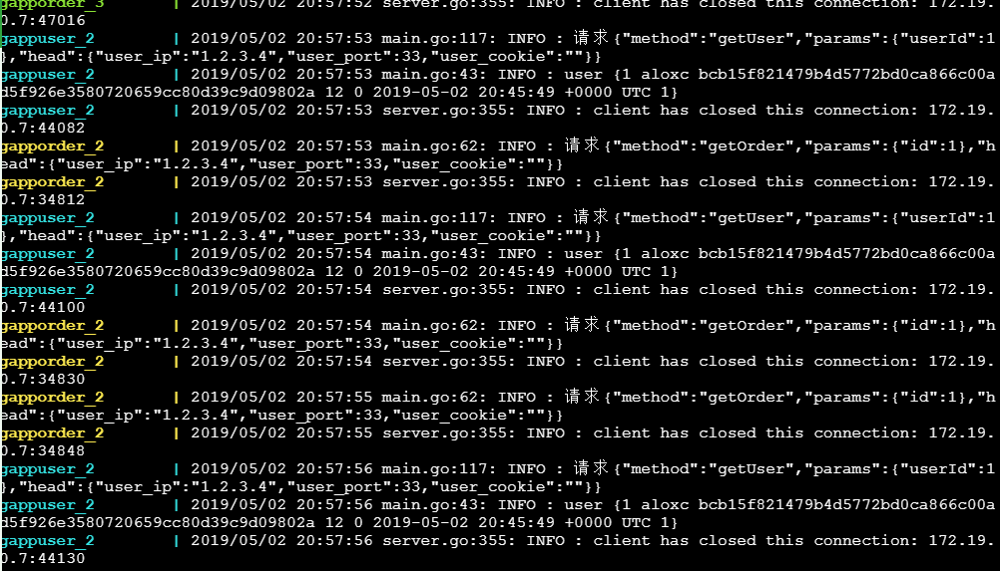

# web服务
### 联系方式：leerohwa#gmail.com，#更换为@
### 本示例所采用的技术：[beego](https://beego.me/)、[beego orm](https://beego.me/docs/mvc/model/overview.md)、[rpcx](http://rpcx.site/)、[redis 5.0.4](https://redis.io/)、[mysql 5.6.43](https://www.mysql.com/)
# tag 1.0 版本 [可以在单宿主机上运行了](https://github.com/aloxc/gappweb/releases/tag/%E5%8F%AF%E4%BB%A5%E5%9C%A8%E5%8D%95%E5%AE%BF%E4%B8%BB%E6%9C%BA%E7%9A%84docker%E7%8E%AF%E5%A2%83%E4%B8%AD%E8%BF%90%E8%A1%8C%E4%BA%86)
--
本版本已经完全支持单宿主机多docker容器运行，在aws上测试有点问题，在[https://labs.play-with-docker.com](https://labs.play-with-docker.com)测试无误，支持user服务和order服务扩容，web咱有由于端口映射还不支持扩容，需要传入以下环境变量：

-  **ORDER_SERVER_HOST**:`gapporder:13331` *web依赖的order服务的地址及端口* 
-  **USER_SERVER_HOST**:`gappuser:13331` *web依赖的user的地址及端口* 
-  **WEB_SERVER_PORT**：`80` *web服务监听端口* 

另外还需要在depends_on指定如下的依赖：
gapporder
gappuser

一个完整的docker-compose.yaml示例如下：

由于1.0版本是使用的单宿主机器，我们设置的网络都是使用桥接网络（gappnetwork），并且服务依赖都直接使用服务名称，没用使用其他服务注册组件。
```
version: "3"
services:
  gappuserredis:
    image: redis
    networks:
      - gappnetwork

  gappusermysql:
    image: mysql:5.6.43
    command: --explicit_defaults_for_timestamp=true
    environment:
      MYSQL_ROOT_PASSWORD: Xjentj53Ijr
      MYSQL_DATABASE: gappuser
    volumes:
      - /gapp/user/mysql:/var/lib/mysql
    networks:
      - gappnetwork

  gappuser:
    image: aloxc/gappuser
    networks:
      - gappnetwork
    depends_on:
      - gappusermysql
      - gappuserredis
    expose:
      - 13331
    environment:
      REDIS_HOST : gappuserredis:6379
      REDIS_MAXIDLE : 1
      REDIS_MAXACTIVE : 10
      SERVER_PORT : 13331
      USER_MYSQL_DATABASE_NAME : gappuser
      USER_MYSQL_HOST : gappusermysql:3306
      USER_MYSQL_USER : root
      USER_MYSQL_PASSWORD : Xjentj53Ijr
      WAIT_MYSQL_SETUP_SECOND: 20

  gappordermysql:
    image: mysql:5.6.43
    command: --explicit_defaults_for_timestamp=true
    environment:
      MYSQL_ROOT_PASSWORD: Jjke34jcjexje*d
      MYSQL_DATABASE: gapporder
    volumes:
      - /gapp/order/mysql:/var/lib/mysql
    networks:
      - gappnetwork

  gapporder:
    image: aloxc/gapporder
    networks:
      - gappnetwork
    depends_on:
      - gappordermysql
    expose:
      - 13331
    environment:
      SERVER_PORT : 13331
      ORDER_MYSQL_DATABASE_NAME : gapporder
      ORDER_MYSQL_HOST : gappordermysql:3306
      ORDER_MYSQL_USER : root
      ORDER_MYSQL_PASSWORD : Jjke34jcjexje*d
      WAIT_MYSQL_SETUP_SECOND: 20

  gappweb:
    image: aloxc/gappweb
    networks:
      - gappnetwork
    depends_on:
      - gapporder
      - gappuser
    ports:
      - 80:80
    environment:
      ORDER_SERVER_HOST: gapporder:13331
      USER_SERVER_HOST: gappuser:13331
      WEB_SERVER_PORT: ":80"
     
networks:
  gappnetwork:
    driver: bridge
```

